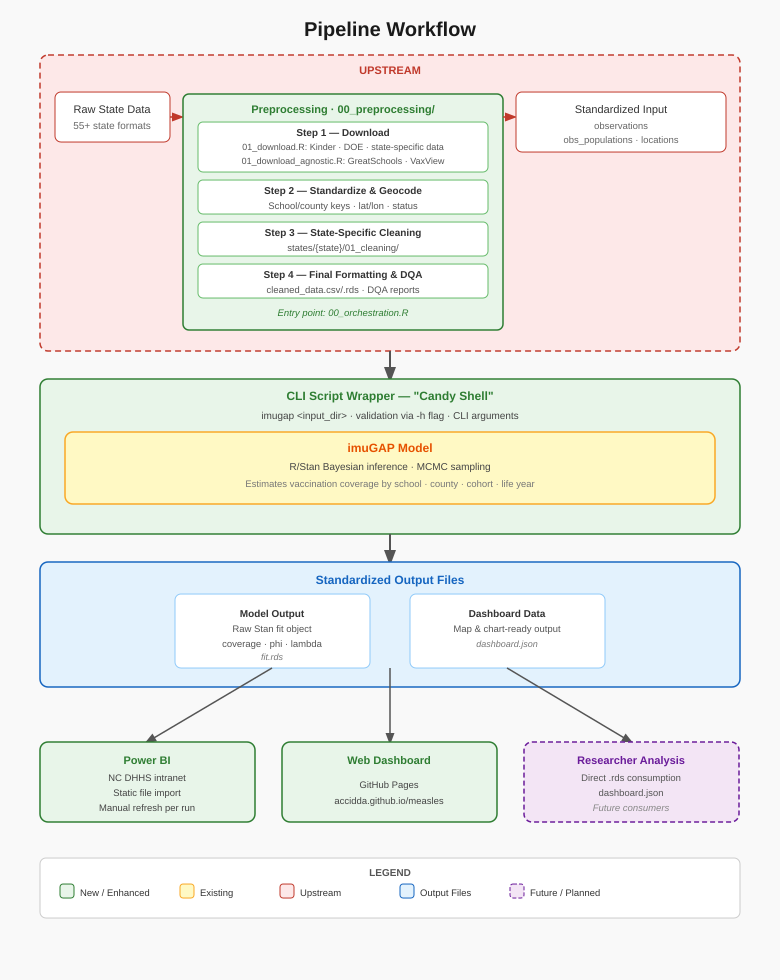

# Pipeline Workflow

## Overview



The system follows a batch processing model. Upstream preprocessing normalizes state-specific data into a standardized input schema. A CLI script wrapper invokes the imuGAP model overnight and emits standardized outputs consumed by downstream systems.

```
┌─ UPSTREAM ──────────────────────────────────────────────────────────┐
│                                                                      │
│  Raw State Data                                                      │
│  (55+ state formats)                                                 │
│        │                                                             │
│        ▼                                                             │
│  ┌─ Preprocessing  (00_preprocessing/) ──────────────────────────┐  │
│  │  ├── Step 1: Download                                          │  │
│  │  │   01_download.R: Kinder · DOE · state-specific data        │  │
│  │  │   download_agnostic_data(): GreatSchools · VaxView         │  │
│  │  ├── Step 2: Standardize school names, assign unique IDs,      │  │
│  │  │           geocode                                           │  │
│  │  ├── Step 3: State-specific cleaning                           │  │
│  │  │           (states/{state}/01_cleaning/)                     │  │
│  │  └── Step 4: Final formatting & DQA checks                     │  │
│  │                                                                │  │
│  │  Entry point: 00_orchestration.R                               │  │
│  └────────────────────────────────────────────────────────────────┘  │
│        │                                                             │
│        ▼                                                             │
│  Standardized Input (observations · obs_populations · locations)      │
└──────────────────────────────────────────────────────────────────────┘
          │
          ▼
┌─ CLI Script Wrapper ("Candy Shell") ────────────────────────────────┐
│  imugap <input_dir>  · validation via -h flag  · CLI arguments       │
│                                                                      │
│  ┌─ imuGAP Model ─────────────────────────────────────────────────┐  │
│  │  R/Stan Bayesian inference · MCMC sampling                     │  │
│  └────────────────────────────────────────────────────────────────┘  │
└──────────────────────────────────────────────────────────────────────┘
          │
          ▼
  Standardized Output Files
  ├── Model Output   (coverage estimates, phi/lambda)  →  .rds
  └── Dashboard Data (map & chart-ready)               →  dashboard.json
          │
   ┌──────┴──────┐
   ▼             ▼
Power BI       Web Dashboard
(NC DHHS)      (GitHub Pages)
```

---

## Preprocessing Steps (`00_preprocessing/`)

| Step | Script / Function | State-specific? | Output |
|------|------------------|----------------|--------|
| 00 | `vignettes/preprocessing-orchestration.R` | No | Master script — calls all steps below |
| 01a | `states/{state}/01_download.R` | Yes | State kindergarten, DOE, optional state-specific dataset |
| 01b | `tidyschoolvax::download_agnostic_data()` | No | GreatSchools, VaxView data |
| 02 | `tidyschoolvax::standardize_schools()` | No | School/county keys, geocoded schools, operational status |
| 03 | `states/{state}/01_cleaning/` | Yes | Intermediate cleaned data |
| 04 | `tidyschoolvax::run_final_formatting()` | No | `cleaned_data.csv/.rds`, DQA issue reports |

State-specific scripts live under `00_preprocessing/states/{state}/`. Currently supported: **CA**, **MD**, **NC** (in development).

---

## CLI Wrapper

The wrapper defines the boundary between preprocessing and the model. It is invoked via command line (not a web service) and runs locally on any machine with R ≥ 3.4.0 and imuGAP installed.

**Inputs:** Directory containing three files (`observations`, `obs_populations`, `locations` — CSV or RDS), validated via `imugap -h <input_dir>`.

**Outputs:** Raw Stan fit object (`fit.rds`), dashboard-ready data (`dashboard.json`).

---

## imuGAP Model

Takes preprocessed data and runs Bayesian inference via Stan MCMC to estimate vaccination coverage by school, county, cohort, and life year. Outputs are used to generate dashboard-ready files.

---

## Downstream Consumers

The standardized output files are consumed by:

- **Power BI** — NC DHHS intranet; static file import, manual refresh after each model run
- **Web Dashboard** — GitHub Pages (`accidda.github.io/measles`); 
- **Researcher Analysis** — direct `.rds` / CSV consumption
